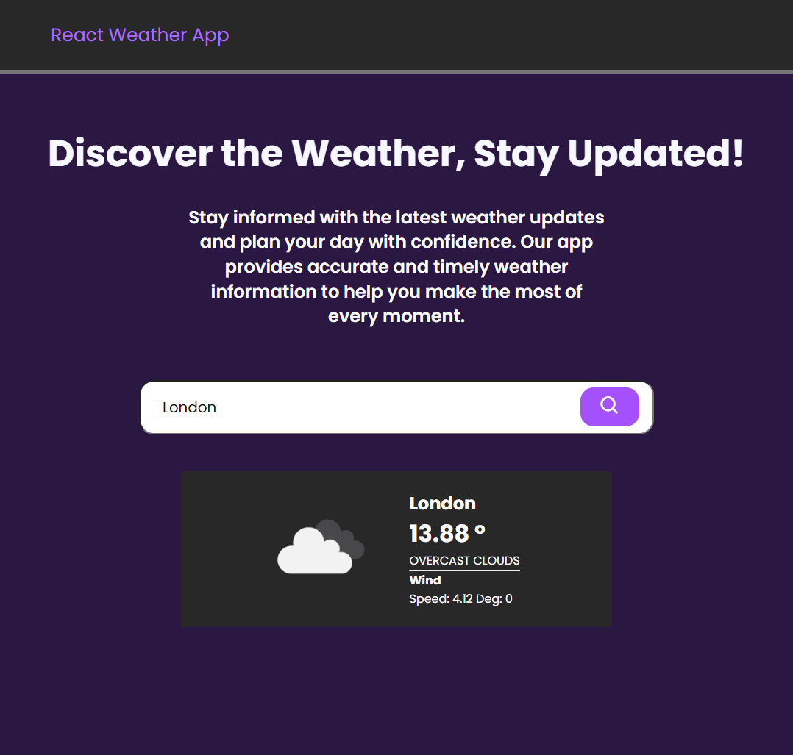

# React Weather App
A simple weather app built with React, TypeScript, and the OpenWeatherMap API.

## Features

- Search weather information by location.
- Display current temperature, weather condition, and other relevant data.
- Creative UI UX
# React Weather App
A simple weather app built with React, TypeScript, and the OpenWeatherMap API.



## Features

- Search weather information by location.
- Display current temperature, weather condition, and other relevant data.
- Creative UI/UX

## Installation

Clone the repository:

```sh
git clone https://github.com/alonzojoe/react-ts-weather-app
```

```sh
run npm install
```

```sh
run npm run dev
```

Usage
Enter a location in the search input field.
Click the "Search" button to fetch weather information for the entered location.
The app will display the current temperature, weather condition, and other relevant data.
